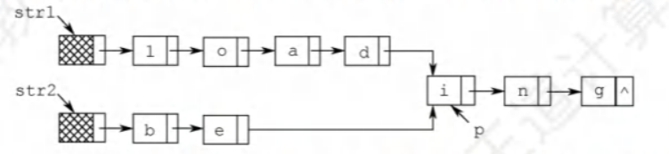
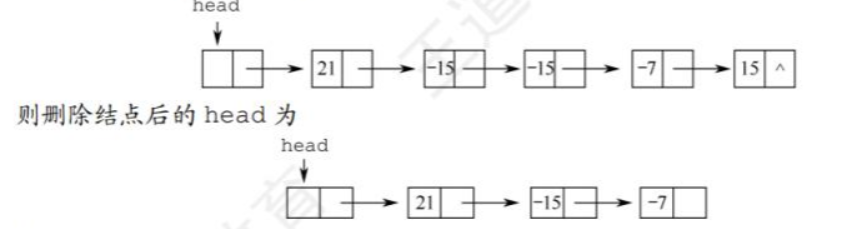
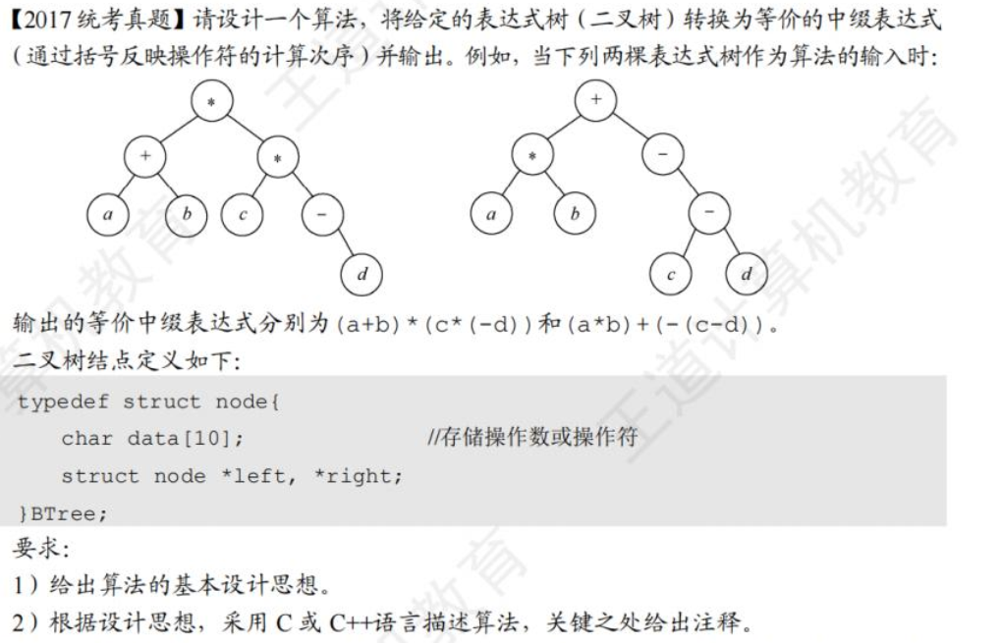
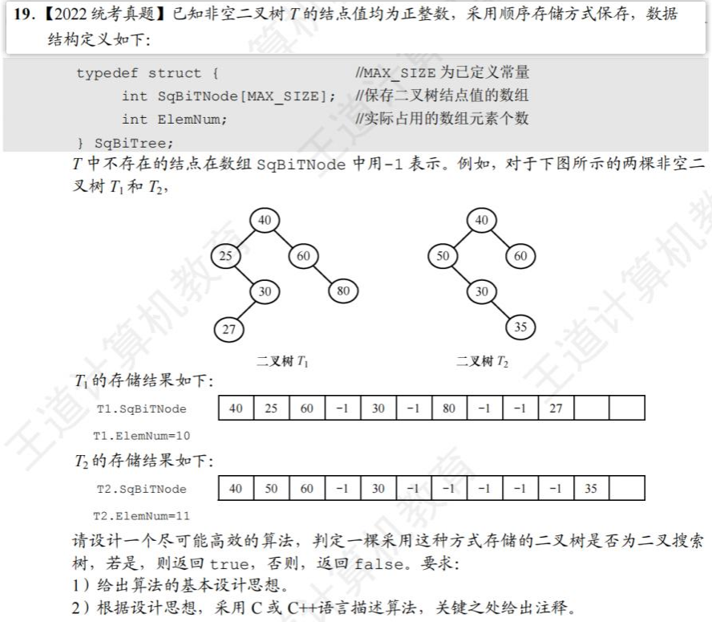
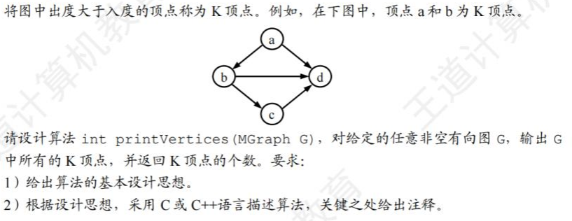

> 作为408考试的算法题，不要求考虑特殊的边界条件，只要算法思想正确，代码逻辑正确，即可得满分。因此，在复习过程中，无须花过多的时间抠代码的各种边界条件。
>

# 线性表

**10.【2010统考真题】**设将n（n>1）个整数存放到一维数组R中。设计一个在时间和空间两方面都尽可能高效的算法。将R中保存的序列循环左移p（O<p<n）个位置，即将R中的数据由(Xo,X1,..,Xn-1)变换为(Xp,Xp+1,...,X-1,Xo,X1,…,Xp-1)。

**解答**

1）：将整个数组R逆置，再将前n-p个元素和后p个元素分别逆置

2）：

```C++
void reverse(int *array,int l, int r){   //l,r代表逆置的区间
    while(l<r){
        swap(a[l],a[r])
        l++,r--;
    }
}
void LeftShift(int *R, int p){   //p为左移的位数
    reverse(R,0,n-1);  //将整个数组逆置
    reverse(R,0,n-p-1);  //将前n-p个元素逆置
    reverse(R,n-p,n-1); //将最后p个元素逆置
}
```

3)：时间复杂度为O(n)  空间复杂度为O(1)

**11.【2011统考真题】**一个长度为L（L≥1）的升序序列S，处在第L/2个位置的数称为S的中位数。例如，若序列S=(11,13,15,17,19)，则S的中位数是15，两个序列的中位数是含它们所有元素的升序序列的中位数。例如，若S2=(2,4,6,8,20)，则S和S2的中位数是11。现在有两个等长升序序列A和B，试设计一个在时间和空间两方面都尽可能高效的算法，找出两个序列A和B的中位数。

**解答：**

1）：设置两个指针分别从A、B的第一个位置开始遍历，如果A[i]>=B[j],就让j自加1,如果A[i]<B[j]，就让i自加1

再设置一个计数器cnt，每次判断自加1，加到n/2时就找到了中位数

2):

```C++
int FindMiddle(int *a, int *b){
    int i=0,j=0;
    int cnt=0;  //计数器
    while(i<n&&j<n){
        cnt++;
        if(a[i]>=b[j]) {
            if(cnt==n) return b[j];
            j++;
        }
        else {
            if(cnt==n) return a[i];
            i++;
        }
    }
}
```

3): 时间复杂度O(n),空间复杂度O(1)

**12.【2013统考真题】**已知一个整数序列A=(a0,α1，...,αn-1)，其中 0≤a<n（0≤i<n）。若存在ap1=αp2=...=αpm=x且 m>n/2（0≤pk<n,1≤k≤m），则称x为 A的主元素。例如A=(0,5,5,3,5,7,5,5)，则5为主元素；又如A=(0,5,5,3,5,1,5,7)，则A中没有主元素。假设A中的n个元素保存在一个一维数组中，请设计一个尽可能高效的算法，找出A的主元素。若存在主元素，则输出该元素；否则输出-1。要求：

**解答：**

1）：使用hash的思想，使用一个辅助数组count[n]来存储各个元素出现的次数，如count[2]=5就代表2在序列中出现了5次。遍历一遍数组将所有元素出现的次数求出来，再遍历数组count[],找到最大的那个数max，如果max>n/2,则主元素就是max在count中对应的下标，否则没有主元素

2):

```C++
 const int n=10;
 int count[n]={0};
 int max=0;
 int max_idx;  //count中最大元素的下标
 void primeElem(int *a){
     for(int i=0 ; i<n ; i++)  //计算每个元素出现的次数
         count[a[i]]++;
     for(int i=0 ; i<n ; i++) { //找到出现次数最多的元素
         if(count[i]>max) {
             max=count[i];
             max_idx=i;
         }
     }
     if(max>n/2) return i;
     return -1;
 }
```

3): 时间复杂度O(n)  空间复杂度O(n)

**13.【2018统考真题】**给定一个含n（n≥1）个整数的数组，请设计一个在时间上尽可能高效的算法，找出数组中未出现的最小正整数。例如，数组{-5,3,2,3}中未出现的最小正整数是1；数组{1,2,3}中未出现的最小正整数是4。

1): 先使用快速排序将数组从小到大排序，然后从前往后遍历找到第一个正整数x，若x>=2,则未出现的最小正整数为1.  否则x<1,继续往后遍历，并比较相邻的两个元素, 若a[i+1]-a[i] >=2, 则答案为a[i]+1.  若遍历到了末尾还没找到答案，则答案为a[n-1]+1

2): 

```C++
//快排的思想，随便找一个数作为中间值，将大于这个数的元素放到左边，小于的放到右边 
void quickSort(int *a, int left, int right){
    if(left>=right) return; //递归结束条件(只有一个元素时)
    int i=left,j=right;
    int tmp = a[left];
    while(i<j){
        while(i<j&&a[j]>tmp) j--;   //找到右边第一个小于tmp的数
        if(i<j){
            a[i]=a[j];  //将找到的j位置的元素移动到左边
            i++;
        }
        while(i<j&&a[i]<tmp) i++;   //找到左边第一个大于tmp的数
        if(i<j){
            a[j]=a[i];  //将找到的i位置的元素移动到右边
            j--;
        }
    }
    a[i]=tmp;  //此时i=j，将中间值归位
    quickSort(a,left,i-1);
    quickSort(a,i+1,right);
}

int MinInterger(int *a, int n){
    quickSort(a,0,n-1);
    int idx=0;
    while(a[idx]<=0) idx++; //找到第一个正整数
    if(a[idx]>=2) return 1;
    for(; idx<n-1 ; idx++){
        if(a[idx+1]-a[idx]>=2) return a[idx]+1;
    }
    return a[n-1]+1;
}
```

3): 时间复杂度 O(nlogn)  空间复杂度O(1)

**14.【2020统考真题】**定义三元组（a,b,c)（a,b,c均为整数）的距离D=|a-b|+|b-c|+|c-a|。给定3个非空整数集合S、S2和S3，按升序分别存储在3个数组中。请设计一个尽可能高效的算法，计算并输出所有可能的三元组(a,b,c)（a∈S，beS，c∈S;）中的最小距离。例如S={-1,0,9},S2={-25,-10,10,11}，S={2,9,17,30,41}，则最小距离为2，相应的三元组为(9,10,9)。

1): 

1. 初始化三个指针 i、j 和 k，分别指向集合 S、S2 和 S3 的第一个元素。
2. 计算当前三元组 (S[i], S2[j], S3[k]) 的距离，并更新最小距离。
3. 移动距离最小的元素所在集合的指针，直到其中一个指针到达了末尾。
4. 重复步骤 3 和 4，直到遍历完所有可能的三元组。

2):

```C++
int minDistance(vector<int>& S, vector<int>& S2, vector<int>& S3) {
    int min_distance = INT_MAX;

    int i = 0, j = 0, k = 0;

    while (i < S.size() && j < S2.size() && k < S3.size()) {
        int current_distance = abs(S[i] - S2[j]) + abs(S2[j] - S3[k]) + abs(S3[k] - S[i]);
        min_distance = min(min_distance, current_distance);

        // 移动距离最小的元素所在集合的指针
        int min_value = min({S[i], S2[j], S3[k]});
        if (min_value == S[i]) {
            i++;
        } else if (min_value == S2[j]) {
            j++;
        } else {
            k++;
        }
    }

    return min_distance;
}
```

3）：时间复杂度O(n) 空间复杂度O(1)

**17.【2009统考真题】**已知一个带有表头结点的单链表，结点结构为|data|link|，假设该链表只给出了头指针list。在不改变链表的前提下，请设计一个尽可能高效的算法，查找链表中倒数第k个位置上的结点（k为正整数）。若查找成功，算法输出该结点的data域的值，并返回1；否则，只返回0。要求：

1）描述算法的基本设计思想

2）描述算法的详细实现步骤。

3）根据设计思想和实现步骤，采用程序设计语言描述算法（使用C、C++或Java语言实现），关键之处请给出简要注释。

**解答**

1. 用两个指针，一个从头节点往后移动k个位置，再两个指针同时移动，即两个指针相差k个元素，当前面的指针指向了NULL，此时后面的指针就指向的是倒数第k个位置的节点
2.  
   1. 定义两个指针fast,slow,将头指针list赋值给它们
   2. fast向后移动k次
   3. fast和slow一起向后移动，直到fast为NULL
   4. 此时slow指向倒数第k个位置

```C++
//单链表的结构
typedef struct DNode{
    int data;
    DNode *link;
}DNode, *Linklist;

int FindLastK(Linklist list,int k){
    DNode *fast=list;
    DNode *slow=list;
    while(k--&&fast!=nullptr)
        fast = fast->link;
    if(k!=-1) return 0;  //元素小于k，查找失败
    while(fast!=nullptr){
        fast=fast->link;
        slow=slow->link;
    }
    cout<<slow->data;
    return 1;
}
```

**18.【2012统考真题】**假定采用带头结点的单链表保存单词，当两个单词有相同的后缀时，可共享相同的后缀存储空间，例如，loading和being的存储映像如下图所示。



设str1和str2分别指向两个单词所在单链表的头结点，链表结点结构为|data|next|请设计一个时间上尽可能高效的算法，找出由str1和str2所指向两个链表共同后缀的起始位置（如图中字符i所在结点的位置p）。要求：

**解答**

1. 
   1. 用两个指针i，j分别指向str1和str2的头节点
   2. 若str1比str2的长度长k，则i先向后移动k个位置，然后i，j同步移动
   3. 同步移动的过程中，使用标记若i->data==j->data且标记为flag==0,则用指针p记录位置，并将标记位flag置为1.若i->data！=j->data,flag置0（flag为0表示还未开始匹配）
   4. 直到i，j移动到末尾，此时p指向后缀的起始位置

```C++
typedef struct Node{
    int data;
    Node *next;
}Node,*Linklist;
//求链表长度
int Listlen(Linklist list){
    Node *p = list;
    int len=0;
    while(p->next!=nullptr) {
        p=p->next;
        len++;
    }
    return len;
}
Node *findSuffix(Linklist str1, Linklist str2){
    Node *i=str1, *j=str2;
    int str1_len = Listlen(str1);
    int str2_len = Listlen(str2);
    if(str1_len > str2_len){
        int k = str1_len-str2_len;
        while(k--) i = i->next;
    }
    int flag=0;
    Node *p=nullptr;
    while(i!=NULL){
        if(i->data != j->data) flag=0;
        else if(flag==0) p = i;  //i和j指向的data相等，记录p的位置，如果flag==1，说明不是后缀第一个位置
    }
    return p;
}
```

1. 时间复杂度O(m+n)  空间复杂度O(1)

**19.【2015统考真题】**用单链表保存m个整数，结点的结构为[data][link]，且|data|≤n（n为正整数）。现要求设计一个时间复杂度尽可能高效的算法，对于链表中data的绝对值相等的结点，仅保留第一次出现的结点而删除其余绝对值相等的结点。例如，若给定的单链表head如下：



1.  
   1. 使用一个辅助数组 bool exist[n]来链表中出现过的元素的绝对值，例如exist[21]=true则表示21在链表中出现过
   2. 遍历一遍链表，存储出现过的元素的绝对值
   3. 再遍历一遍链表，将除第一次出现位置的元素都删除

```C++
typedef struct Node{
    int data;
    Node *link;
}Node, *Linklist;

void delSameAbs(Linklist list）{
    if(list->next==nullptr) return list; //空链表 直接返回
    bool *exist = new bool(n);
    Node *p = list->next;
    while(p->next!=nullptr){
        exist[abs(p->data)] = true;
        p=p->next;
    }
    Node *p = list;
    while(p->next!=nullptr){
        if(exist[abs(p->next->data)])  //遇到第一个，跳过
            exist[abs(p->next->data]=false;
        else{   //后面的删掉
            Node *tmp = p->next;
            p->next = p->next->next;
            delete tmp;
            tmp=nullptr;
        }
        p=p->next;
    }
}
```

1. 时间复杂度O(n) 空间复杂度O(n)

**20.【2019统考真题】**设线性表L=（a1，a2，...,a(n-1)，an）采用带头结点的单链表保存，链表中的结点定义如下：

```C++
typedef struct node
{    int data;
     struct node*next;
}NODE;
```

**请设计一个空间复杂度为O(1)且时间上尽可能高效的算法，重新排列L中的各结点，得到线性表L'=（a1，an，a2,a(n-1), a3,a(n-2), ...)**

todo

```
```


# 栈与队列

**使用两个栈模拟队列**

```C++
struct Que{
    stack<int> s1,s2;
    //入栈前将s1中的元素全部转移到s2中，然后再入栈
    void push(int x){
        while(!s1.empty()){
            s2.push(s1.top());
            s1.pop();
        }
        s1.push(x);
    }
    //出栈前将s2中的元素全部转移到s1中，然后再出栈
    void pop(){
        while(!s2.empty()){
            s1.push(s2.top());
            s2.pop();
        }
        cout<<s1.top()<<endl;
        s1.pop();
    }
};
```


**假设一个算术表达式中包含圆括号，方括号和花括号3种类型的括号，编写一个算法来判别表达式中的括号是否配对，以字符“0”作为算术表达式的结束符。**

答：

**从左到右遍历表达式，遇到左括号考虑入栈，遇到右括号考虑出栈。**

规定：‘（’的优先级最高，‘}’的优先级最低  [{}] 为不合法 (若没有这项规定则不需要判断优先级)

下面来考虑不匹配的情况

- 当前遍历到的为与栈顶不匹配的**右括号**
- 当前遍历到的为**左括号**，但其优先级比栈顶的左括号低  --也就是（{，（[, [{这样的情况*
- 最终栈不为空

栈的数据结构就省略了

```c++
bool cmp(char a, char b){ // a为栈顶，b为当前元素 如果a的优先级高于b，返回true
    switch (a) {
        case '(':
            if(b=='{' || b=='[')
                return false;
            else
                return true;
            break;
        case '[':
            if(b=='{')
                return false;
            else
                return true;
            break;
        default:
            return true;
    }
}

bool brackets_cmp(string &str){
    stack s;
    for(int i=0 ; i<str.size() ; i++){
        char c = s.top(); 
        if(str[i]=='(' || str[i]=='[' || str[i]=='{'){ //左括号考虑入栈
            if(cmp(c,str[i])) //'(' 的优先级最高,如果栈顶元素优先高于当前元素，入栈
                s.push(str[i]);
            else
                return false;
        }
        else{ //右括号考虑出栈
            if(c=='(' && str[i]==')' || c=='[' && str[i]==']' || c=='{' && str[i]=='}')
                s.pop();
            else
                return false;
        }
    }
    if(s.empty()==-1)
        return true;
    else
        return false;
}
```


# KMP算法

在“abababca”中寻找是否存在子串“ababca”

- 模式串：ababca
- 匹配串：abababca

next数组记录**模式串**中对应位置的字串的最长相等前后缀的长度，也就是字符串匹配时应该回退的下标

next[i]表示s[0...i-1]的**最长相等前后缀**长度

- **前缀**是指不包含最后一个字符的所有以**第一个字符开头**的连续子串；
- **后缀**是指不包含第一个字符的所有**以最后一个字符结尾**的连续子串

**时间复杂度**

> O(n+m)

[力扣28](https://leetcode.cn/problems/find-the-index-of-the-first-occurrence-in-a-string/submissions/505367894/)

```C++
class Solution {
public:
    int _next[10005];
    void getNext(string s,int *_next){ // 求next数组 next[i]表示s[0...i-1]的最长公共前后缀长度
        int i=1,j=0;
        _next[0]=-1;
        int n = s.size();
        while(i<n){
            if(j==-1 || s[i]==s[j]){ //匹配，往后移动
                i++;j++;
                _next[i] = j;
            }
            else j=_next[j]; //不匹配，回退
        }
        
    }
    int strStr(string haystack, string needle) {
        int n = haystack.size(), m = needle.size();
        if(m == 0) return 0;
        getNext(needle,_next);
        int i=0,j=0;  //j是needle的下标，i是haystack的下标
        while(i<n && j<m){
            if(j==-1 || haystack[i]==needle[j]){
                i++;j++;
            }
            else j=_next[j];
        }
        if(j==m) return  i-m;
        return -1;
    }
};
```

改进next -> nextval

手算参考 [数据结构——全网最简单求nextval数组，三分钟搞定](https://www.bilibili.com/video/BV1H24y1p7u6?vd_source=64b252ff29327deb03582db5a8c18de0)

```
void getNextval(string s,int *_nextval){ // 求next数组 next[i]表示s[0...i-1]的最长公共前后缀长度
	int i=1,j=0;
	_nextval[0]=-1;
	int n = s.size();
	while(i<n){
		if(j==-1 || s[i]==s[j]){ //匹配，往后移动
			i++;j++;
			if(s[i] != s[j]) 
				_nextval[i] = j;
			else
				_nextval[i] = nextval[j];
		}
		else j=_nextval[j]; //不匹配，回退
	}
}
```


# 树与二叉树


**【2014统考真题】**二叉树的带权路径长度（WPL）是二叉树中所有叶结点的带权路径长度之和。给定一棵二叉树T，采用二叉链表存储，结点结构为 |left|weight|right| 其中叶结点的weight域保存该结点的非负权值。设root为指向T的根结点的指针，请设计求T的WPL的算法，

要求：

​	1）给出算法的基本设计思想。

​	2）使用C或C++语言，给出二叉树结点的数据类型定义。

​	3）根据设计思想，采用C或C++语言描述算法，关键之处给出注释。


1. 二叉树的WPL值=树中全部叶结点的带权路径长度之和=

   **根结点左子树中全部叶结点的带权路径长度之和** + **根结点右子树中全部叶结点的带权路径长度之和**

   叶结点的带权路径长度 = 该结点的**weight**域的值 x 该结点的**深度**

   递归求即可

   > WPL也等于所有非叶子结点的权重之和

2. 

   ```c++
   typedef struct BiTNode{
       int data;
       struct node* lchild;
       struct node* rchild;
   }BiTNode, *BiTree;
   ```

3. ```c++
   int WPL(BiTNode* T, int height){ //当前遍历的结点以及其深度
       if(T==NULL) return 0;
       if(T->lchild == NULL && T->rchild == NULL){  //叶子结点
           return T->data * height;
       }
       return WPL(T->lchild,height+1) + WPL(T->rchild,height+1);
   }
   WPL(T,1); //函数调用
   ```




1. 本体的难点在于加括号，处理思想为，若遍历到的结点有孩子，就先加左括号，再遍历左孩子->根->右孩子，最后再加右括号。按此逻辑对中序遍历加以改造即可。注意，根结点对应的最”外面“的表达式不需要括号

2. ```c++
   void InOrder(node* p, int depth){
       if(p==NULL) return;
       else if(!node->left && !node->right){ //叶子结点，不需要加括号
           cout<<p->data;
       }
       else{ //非叶子结点
           if(depth>1)  cout<<'(';
           InOrder(p->left,depth+1);
           cout<<p->data;
           InOrder(p->right,depth+1);
   		if(depth>1)  cout<<')';
       }
   }
   
   ```




**TODO://二叉搜索树的概念在第七章的查找中**


**【2012统考真题】**设有6个有序表A,B，C，D,E，F，分别含有10,35,40,50,60和200个数据元素，各表中的元素按升序排列。要求通过5次两两合并，将6个表最终合并为1个升序表，并使最坏情况下比较的总次数达到最小。请回答下列问题：

1）给出完整的合并过程，并求出最坏情况下比较的总次数。

2）根据你的合并过程，描述n（n≥2）个不等长升序表的合并策略，并说明理由。


1. 使用哈夫曼树的思想，每次从集合中选择两个元素个数最小的表合并，最坏情况比较825次（不考虑表间元素数量的比较）。

   1. 将A、B合并为B’，此时B'(45)  C(40)  D(50)  E(60) F(200) 
   2. 将B’、C合并为C'，此时C'(85)  D(50)  E(60) F(200)
   3. 将D、E合并为E’，此时C'(85)  E‘(110) F(200)
   4. 将C’、E‘合并为E”，此时E“(195) F(200)
   5. 最后将E”与F合并为F’(395)

2. ```
   使用双指针合并两个升序表A,B，初始分别使用i，j指向两有序表的第一个元素，每次将较小的那个元素加入到合并表C中，指向较小元素的指针往后指向下一个元素。若二表元素为m、n(m<n), 当i指针指向了A中最后一个元素，也就是第M个元素时，若此时该元素比B中所有元素都大，那么i就会一直等待到B表整个被加入到合并表C中，故最坏比较次数为m+n-1. 所以使用哈夫曼树的思想，每次选择两个元素最少的表进行合并，就能有效减少比较次数。
   ```

   


**【2020统考真题】**若任意一个字符的编码都不是其他字符编码的前缀，则称这种编码具有前缀特性。现有某字符集（字符个数≥2）的不等长编码，每个字符的编码均为二进制的0、1序列，最长为L位，且具有前级特性。请回答下列问题：

1）哪种数据结构适宜保存上述具有前缀特性的不等长编码？

2）基于你所设计的数据结构，简述从0/1串到字符串的译码过程。

3）简述判定某字符集的不等长编码是否具有前缀特性的过程。


1. 哈夫曼树

2. 哈夫曼树的构建：

   - 先初始化一个二叉树的根节点，规定：连接左孩子的边为‘0’，连接右孩子的边为‘1’
   - 从前往后遍历字符对应的01串，遇到0就添加一个左孩子，遇到1就添加一个右孩子，如果到了末尾，则最后添加的这个结点就存储对应的字符

   译码：

   - 设置一个遍历指针p，先指向根节点
   - 遍历01串，遇到0，p就指向p的左孩子，遇到1就指向其右孩子
   - 重复上面的操作直到遍历到01串的末尾，此时p指向的就是该01串对应的字符

3. 由前缀编码的特性可知，在哈夫曼树中每个字符都在叶子结点，所以在构建树的过程中若试图在一个字符所在的结点添加孩子，那么说明该串的前缀中存在其他的串。


# 图 

**【2021统考真题】**已知无向连通图G由顶点集V和边集E组成，|E|>0，当G中度为奇数的顶点个数为不大于2的偶数时，G存在包含所有边且长度为|E|的路径（称为EL路径）。设图G采用邻接矩阵存储，类型定义如下：

```c++
typedef struct {
    int numVertices，numEdges;    // 图中实际的顶点数和边数
    char VerticesList[MAXV];   // 顶点表
    int Edge[MAXV][MAXV];      // 邻接矩阵
} MGraph;
```

请设计算法int IsExistEL（MGraph G)，判断G是否存在EL路径，若存在，则返回1，否则返回0。要求：

1）给出算法的基本设计思想。

2）根据设计思想，采用C或C++语言描述算法，关键之处给出注释

3）说明你所设计算法的时间复杂度和空间复杂度。


1. 不大于2的偶数即2，所以只需要遍历邻接矩阵，判断图G中度为奇数的顶点的个数是否等于2即可。

2. ```c++
   int IsExistEL(MGraph G){
       int count=0;//度为奇数的顶点的个数
       for(int k=0 ; k<MAXV ; k++){  //枚举顶点
           int TD=0;  //顶点k的度
           for(int i=k,j=0; j<MAXV ; j++){ //计算顶点k的出度
               if(G.Edge[i][j]!=0 && G.Edge[i][j]!=∞) TD+=1;
           }
           for(int j=k,i=0; i<MAXV ; i++){ //计算顶点k的入度
               if(G.Edge[i][j]!=0 && G.Edge[i][j]!=∞) TD+=1;
           }
           if(TD%2 != 0) count++;
       }
       if(count==2 || count==0) return 1;
       else return 0;
   }
   ```

3. 由于遍历了整个邻接矩阵，故时间复杂度为O(n), 空间复杂度为O(1)

**【2023统考真题】**已知有向图G采用邻接矩阵存储，类型定义如下：

```c++
typedef struct {
    int numVertices，numEdges;    // 图中实际的顶点数和边数
    char VerticesList[MAXV];   // 顶点表
    int Edge[MAXV][MAXV];      // 邻接矩阵
} MGraph;
```



1. 对每个顶点，在邻接矩阵中找到对应行、列，计算出度与入度，若出度大于入度，则为K顶点，输出，并设置一个变量count记录K顶点的个数

2. ```c++
   int printVertices(MGraph G){
       int count=0; //K顶点的个数
       for(int k=0 ; k<MAXV ; k++){  //枚举顶点
           int ID=0,OD=0;  //编号为k的顶点的入度与出度
           for(int i=k,j=0; j<MAXV ; j++){ //计算出度
               if(G.Edge[i][j]!=0 && G.Edge[i][j]!=∞) OD+=1;
           }
           for(int j=k,i=0; i<MAXV ; i++){ //计算入度
               if(G.Edge[i][j]!=0 && G.Edge[i][j]!=∞) ID+=1;
           }
           if(OD>ID) cout<<G.VerticesList[k]<<endl;
       }
       return count;
   }
   ```

   
